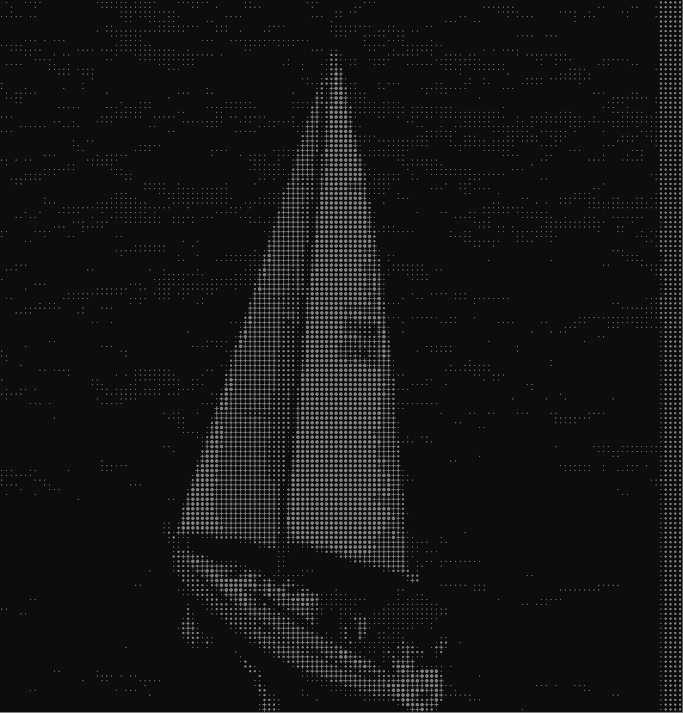

## Setting up

Get your documentation site up and running in minutes.

<Card
  title="Start here"
  icon="rocket"
  href="/quickstart"
  horizontal
>
  Follow our three step quickstart guide.
</Card>

## Our Products

Design a docs site that looks great and empowers your users.

<Columns cols={2}>
  <Card
    title="Yiled"
    
    icon="leaf"
    iconType: light
    href="/products/yiled/overview"
  >
    Secure, expert-led financial products for individuals and institutions.
  </Card>
  <Card
    title="Bridge"
    
    icon="bridge"
    iconType: light
    href="/products/swap/overview"
  >
    Bridge and Swap with best exchange rate from 0 bps fee
  </Card>
    <Card
    title="Gas Refuel"
      
    icon="gas-pump"
    iconType: light
    href="/essentials/navigation"
  >
    Refuel gas tokens 32+ EVM chains.
  </Card>
  <Card
    title="NFT Quest"
    
    icon="map"
    iconType: light
    href="/api-reference/introduction"
  >
    The first upgradable omnichain NFT.
  </Card>
</Columns>

## About L2Pass

Everything you need to create world-class documentation.

<Tile title="Ecosystem Partners">
  
  
</Tile>
---

<Card title="Protocol Metrics" img="/images/metrics_light.svg">
</Card>
---

<Columns cols={4}>
  <Tile href="/components/accordions" title="Liquid Yield" description="up to 12% on USDT">
    
    
  </Tile>
  <Tile href="/components/accordions" title="Swap & Bridge" description="From 0% tx fees">
   
    
  </Tile>
  <Tile href="/components/accordions" title="Gas Refuel" description="Top up gas in 33 EVM chain">
    
    
  </Tile>
    <Tile href="/components/accordions" title="NFT Quest" description="First omnichain upgradable NFT">
    
    
  </Tile>
</Columns>